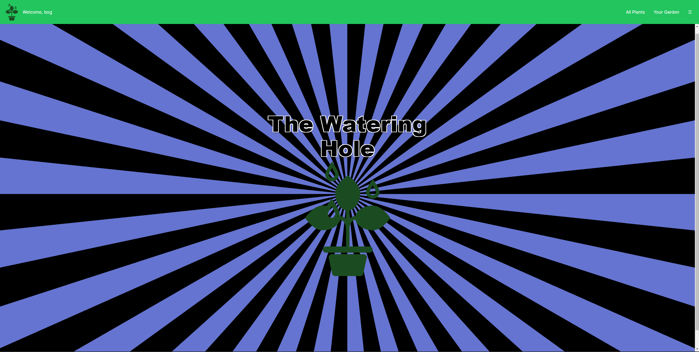

# The Watering Hole

The Watering Hole is a plant app designed to help plant enthusiasts track and manage their plants. Whether you have a small indoor garden or a large outdoor space, this app provides a convenient way to keep all your plant-related information in one place.

### [Launch The Watering Hole](https://main--the-watering-hole.netlify.app/)

# Links 🔗
- [Back-End Server](https://github.com/CurrentlyBob/the-watering-hole)
- [Follow Me On Twitter](https://twitter.com/CurrentlyBog)

## Technologies Used:
* TypeScript
* React.js
* Express.js
* Node.js
* Sequelize
* PostgresSQL
* JWT Authentication
* Javascript
* Tailwind CSS
* Prettier
* Netlify
* Fly.io

# Attributions:
- [Icons](https://fontawesome.com/icons)
- [Plant API](https://perenual.com/)

## Icebox Features🧊

Here are some additional features that could be considered for future development:

- **Social Sharing:** Allow users to share their plant collection and updates on social media platforms.
- **Plant Recommendations:** Provide recommendations for suitable plants based on the user's location and preferences.
- **Community Forum:** Enable users to connect and engage with other plant enthusiasts through a dedicated community forum.
